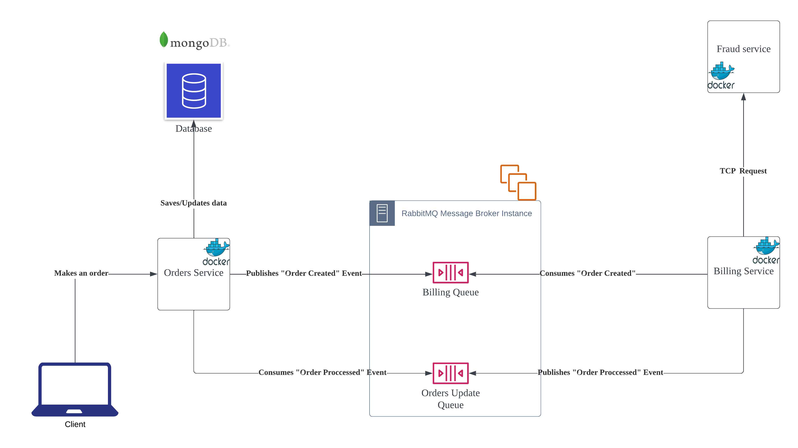

# Contents

Event-driven sample application using **NestJS**, **RabbitMQ** and **MongoDB**



# Run the containers
```bash
docker compose up --build -V
```

# Stop the containers

```bash
docker compose down -v
```
